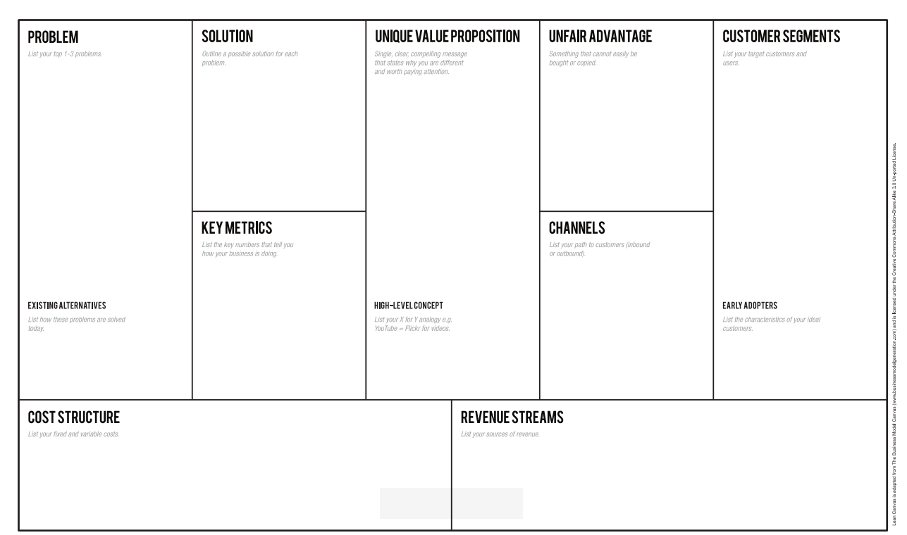
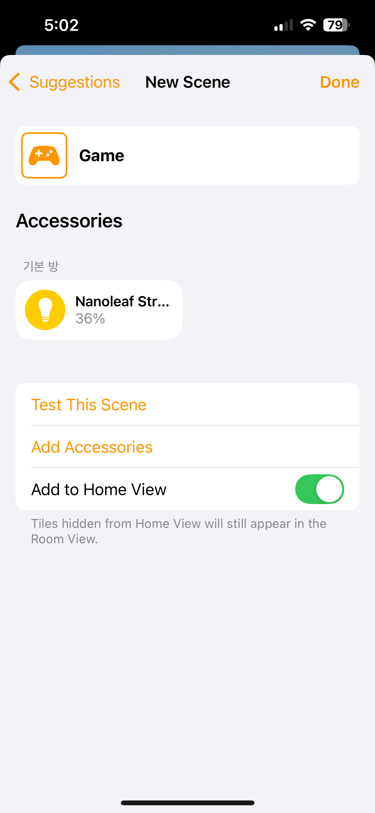

# Lean Canvas: AI-Powered LED Strip Controller

Transform any **cheap, ordinary LED strip** into a **smart, AI-driven lighting system**—without paying a hefty \$20/month or buying an expensive new smart LED kit.

# Table of Contents

- [Problem](#1-problem)
- [Customer Segments](#2-customer-segments)
- [Unique Value Proposition](#3-unique-value-proposition)
- [Solution](#4-solution)
- [Channels](#5-channels)
- [Revenue Streams](#6-revenue-streams)
- [Cost Structure](#7-cost-structure)
- [Key Metrics](#8-key-metrics)
- [Unfair Advantage](#9-unfair-advantage)
- [Additional Action Items (TODO)](#10-additional-action-items-todo)
- [Conclusion](#conclusion)

---

## 1. Problem

- **Limited Functionality & High Cost**: Existing smart LED strips (e.g., Apple HomeKit-compatible) are pricey yet offer little more than voice control.
- **Excessive Manual Setup**: “Shortcuts” for different moods or activities must be pre-configured, which is impractical for every situation.
- **Student Budget Constraints**: Most college students opt for cheaper, standard LED strips (remote or Bluetooth) lacking automation or advanced features.
- **Market Gap**: Students (and potentially 1-person households) want affordable, adaptive, and AI-driven lighting without replacing their entire LED setup.

Existing alternative: **Lepro** (Smart LED strip with 20$ software subscription for AI feature)

> **TODO**
>
> - Conduct broader **market size** research beyond students.
> - Run a **price sensitivity survey** to see what hardware + subscription fees are acceptable.

_Smart Strip's scene setting screen. For every situation, the user have to manually save a preset to use a short cut._

---

## 2. Customer Segments

- **Primary**: College students who already have regular LED strips or plan to buy low-cost LED strips.
- **Tech-Savvy / Efficiency-Focused**: Individuals interested in AI-driven convenience at a reasonable price.
- **Future Expansion**: 1-person households (e.g., those living in small apartments) who want affordable, smart home upgrades.

> **TODO**
>
> - Investigate **purchasing patterns** for these segments (price points, features they value most).
> - Extend surveys/interviews to **one-person households** for potential market expansion.

---

## 3. Unique Value Proposition

> **Let AI Handle It: The Most Affordable & Convenient Smart LED Upgrade Kit**

- **“AI that automatically adjusts your normal LED strips so you don’t have to pay expensive costs—making lighting both smart and affordable.”**
- **Re-use Existing LED Hardware**: No need to discard current strips or invest in a costly new setup.
- **Simple & Adaptive**: Voice-triggered AI automatically fine-tunes color and brightness based on your activities or mood.

---

## 4. Solution

1. **Hardware Upgrade**

   - An Arduino-based device that **hooks** into any standard LED strip, allowing full automation.
   - After initial prototypes, we will hide circuitry using affordable 3D-printed enclosures to improve user experience.

2. **AI-Driven Software**
   - When the user says, “I’m studying,” the system **analyzes** the context and **switches** to bright, cool-toned light.
   - If the user says, “Movie time,” it **dims** the lights to a warm ambiance.
   - Over time, the AI learns personal preferences, enabling **hyper-personalized** recommendations.
   - **Voice-activated** and **app-controlled** for easy access. (MVP will be developed in 
   webpage form.)

---

## 5. Channels

- **Campus Trials**: Deploy prototypes at Denison University for quick feedback and iteration.
- **Early Promotion**
  - Share project details on LinkedIn.
  - If market potential grows, explore additional student-friendly social platforms (TikTok, school networks, etc.).
- **Sales Approach**
  - **Direct Sales** initially for close feedback loops and user testimonials.
  - Transition to **online marketplaces** (Amazon, crowdfunding) once product-market fit is validated.

---

## 6. Revenue Streams

1. **Hardware**: Sold near cost price to encourage adoption (small margin possible to offset Free tier AI).
2. **Subscription (SaaS) Model (NOT FINAL)**
   - **Free Tier**: Up to 10 AI requests per month; basic scheduling.
   - **Plus (\$3.99/month)**: 50 AI requests, advanced automation features.
   - **Pro (\$5.99/month)**: 100 AI requests, Alexa integration, plus everything in Plus.

> **TODO**
>
> - Survey or beta-test to gauge **feature desirability** (e.g., extended AI requests, scheduling).
> - Calculate **AI API costs** precisely to refine subscription pricing.
> - Model **free vs. paid user mix** and potential usage spikes to ensure cost coverage.

---

## 7. Cost Structure

- **Fixed Costs**:
  - Server, database hosting, and software maintenance.
  - Initial hardware prototyping expenses (Arduino/PCB/3D printing).
- **Variable Costs**:
  - AI API calls (OpenAI, STT services, etc.).
  - Incremental hardware production as user base grows (ordering parts in bulk, assembly).

> **TODO**
>
> - Explore break-even points for subscription tiers vs. AI call expenses.
> - Consider early small-batch manufacturing or custom assembly to handle MOQ constraints.

---

## 8. Key Metrics

- **Hardware Sales**: Units sold each quarter.
- **Subscription Conversions**: Percentage of hardware users upgrading to Plus or Pro.
- **Monthly Active Users (MAU)**: Number of users (free + paid) actively controlling their LED strips.
- **Churn Rate**: Cancellation from Plus/Pro back down to Free.
- **Engagement**: Frequency of AI requests, user satisfaction with AI presets.

---

## 9. Unfair Advantage

- **Low-Cost Entry + Existing LED Reuse**: Drastically lower barrier vs. buying expensive new “smart” strips.
- **Customizable & Rapid Iteration**: Starting with Arduino for prototypes, then evolving to custom hardware for scalability.
- **AI Personalization & Data Lock-In**: Continuous learning from each user’s preferences—**hyper-personalization** that’s hard for big competitors to replicate without user-specific historical data.
- **Campus Network & Lean Testing**: Quick user feedback cycles and minimal marketing cost through direct campus demos, building strong early traction.

---

## 10. Additional Action Items (TODO)

- **Market Size Exploration**: Extend beyond students to 1-person households and small apartment residents.
- **Price Sensitivity & MVP Surveys**: Confirm hardware cost acceptance, subscription willingness to pay.
- **AI Cost Analysis**: Finalize “free vs. paid tier” usage limits and AI call expenses.
- **Feature Prioritization**: Validate additional features (scheduler, auto color transitions, etc.) via beta tests.

---
