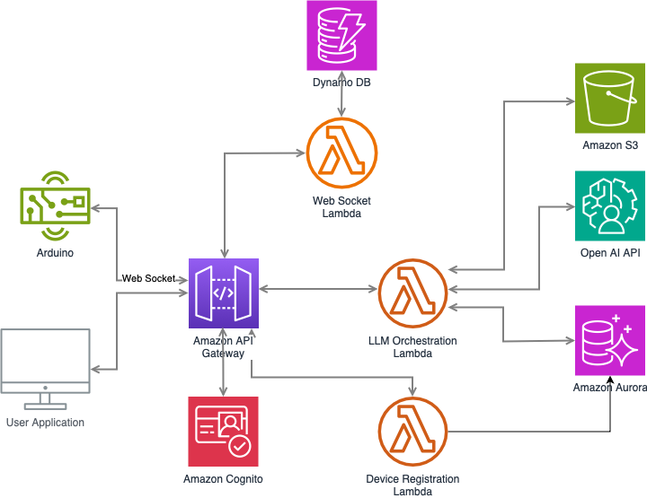
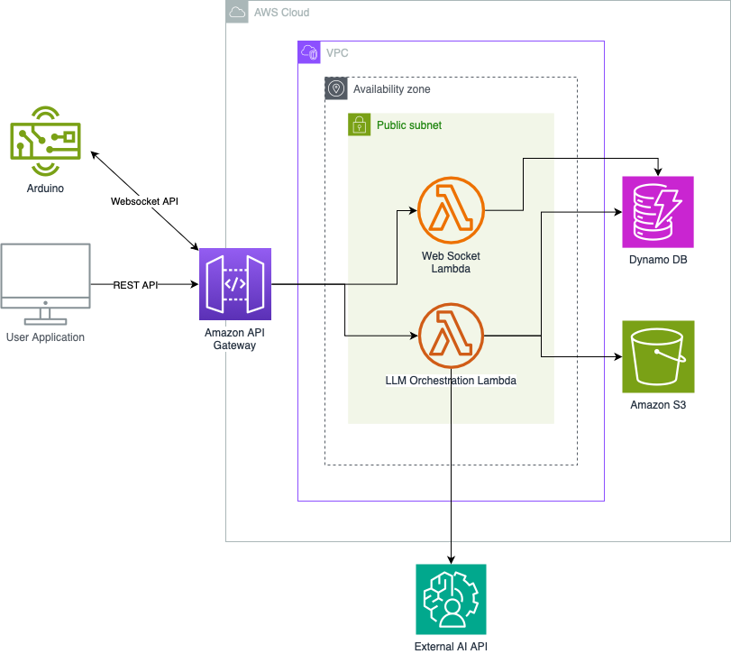

This is the first development note for AI LED controller. For now, I am the sole developer for this project, but starting from next week, we will have more team members for market research and frontend developments.

Let's get started!

## 1. Simplified Architecture Overhaul


_Original Project Architecture_

The initial architecture was too complex for an MVP, resembling a **production-level design**. Given our **development timeline**, we simplified it.

### **Key Changes**

#### **Removed RDS**

1. **Security Concerns**: RDS must be placed in a **private subnet**, meaning that Lambda must also be in a **private subnet** to access it.
2. **Lambda Limitations**: If Lambda is in a private subnet, it complicates API access (e.g., Gemini API) since internet access requires a **NAT Gateway**, adding both **cost** and **complexity**.
3. **Solution**: Replaced RDS with **DynamoDB**:
   - Utilizes **Partition Key + Sort Key** for structured storage.
   - **Direct AWS service network access** (not bound to VPC).
   - Fully managed → **Lower operational overhead** & **easier maintenance**.
   - **Simplified architecture for MVP**.

#### **Removed Login Feature (AWS Cognito)**

1. **Authentication complexity** is unnecessary in an MVP.
2. **Replaced with a simple mock login**:
   - Uses **Device UUID + PIN** for minimal security.
3. **Known security risks**:
   - Vulnerable to **replay attacks** & **client-side exploits**.
4. **Decision**: Acceptable for MVP, **security will be enhanced in future iterations**.

#### **Manual Device Registration**

1. Since authentication is removed, **devices will be manually registered** in the MVP.
2. Given the **limited number of users**, **manual configuration is feasible**.
3. **Result**: **Lower complexity** & **faster development**.


_Changed Project Architecture_

---

## 2. LLM Orchestration Lambda Development

Developed the **LLM Orchestration Lambda**, covering:

### **Authentication**

- Queries the `auth table` to verify `(uuid, pin)`.

### **Audio Processing via Gemini API**

- Calls **Gemini API** for processing.

### **Success Handling from Gemini API**

1. **Store JSON response** in **S3** (`user/{arduino_uuid}/...`) with **encryption**.
2. **If the response contains an RGB command**:
   - Query **DynamoDB** for **preset colors**.
   - **Find the closest RGB match**.
   - **Compute RGB adjustments**.
3. Retrieve the **`connection_id`** from **websocket table** using `arduino_uuid`.

---

## 3. Gemini Prompt Engineering Completed

We finalized the **Gemini AI Prompt & Structured Output**.

### 🎯 **AI Prompt**

```
You are an AI assistant designed to analyze audio input and recommend light settings based on the user’s emotional state, context, and time, while utilizing light therapy principles.

**Instructions:**

1. **Analyze Audio**:
   - Detect emotional cues & context (e.g., studying, gaming, sadness).
   - Consider the time of day.

2. **Determine Light Settings**:
   - **Color**: RGB [R, G, B] (0–255) or a **dynamic mode** (FLASH, FADE, etc.).
   - **Brightness**: 0–7.

3. **Identify Emotions**:
   - **Main emotion**: Positive, Negative, Neutral.
   - **Three subcategories** (e.g., Happiness, Excitement, Anxiety).

4. **Apply Light Therapy**:
   - **Morning/Afternoon** → Use bright, cool-toned lights (white, blue).
   - **Evening/Night** → Use warm tones (amber, red) for relaxation.
   - **Negative emotions** → Use calming/uplifting light settings.
   - **Positive/Neutral emotions** → Reinforce the current state.

5. **Recommendation**:
   - If **negative**, suggest a setting to **improve mood**.
   - If **positive/neutral**, reinforce their current state.
   - **Provide a concise explanation** of the choice.

6. **Context Consideration**:
   - Summarize the user’s situation.
   - If unclear, use a **random preset**.
```

### 🎯 **Structured Output**

```json
{
  "type": "object",
  "properties": {
    "lightSetting": {
      "type": "object",
      "properties": {
        "color": {
          "type": "string"
        },
        "brightness": {
          "type": "integer"
        },
        "power": {
          "type": "boolean"
        }
      },
      "required": ["color", "brightness"]
    },
    "emotion": {
      "type": "object",
      "description": "Emotion Analysis",
      "properties": {
        "main": {
          "type": "string",
          "enum": ["Positive", "Negative", "Neutral"]
        },
        "subcategories": {
          "type": "array",
          "items": {
            "type": "string",
            "enum": [
              "Happiness",
              "Excitement",
              "Gratitude",
              "Euphoria",
              "Pride",
              "Calmness",
              "Satisfaction",
              "Contentment",
              "Serenity",
              "Relief",
              "Astonishment",
              "Pleasant Surprise",
              "Disappointment",
              "Loss",
              "Loneliness",
              "Depression",
              "Regret",
              "Frustration",
              "Annoyance",
              "Rage",
              "Resentment",
              "Betrayal",
              "Anxiety",
              "Terror",
              "Concern",
              "Skepticism",
              "Helplessness",
              "Repulsion",
              "Aversion",
              "Unpleasantness",
              "Loathing",
              "Shock",
              "Unpleasant Surprise",
              "Detachment",
              "Objectivity",
              "Ambivalence",
              "Pragmatism",
              "Logic",
              "Clarity",
              "Balance",
              "Neutrality",
              "Steadiness"
            ]
          }
        }
      },
      "required": ["main", "subcategories"]
    },
    "recommendation": {
      "type": "string"
    },
    "context": {
      "type": "string"
    }
  },
  "required": ["lightSetting", "emotion", "recommendation", "context"]
}
```

---

## 4. Next Week’s Goals

### **Frontend**

- Complete **UI/UX design**.
- Complete creating backend infrastructure with **Terraform**
- Complete **CI/CD pipeline** for Frontend repo

### **Backend**

#### 1️. **Finalizing LLM orchestrator Lambda**

- Complete **full request-handling logic**.

#### 2. **Backend Infrastructure Building**

- Complete creating backend infrastructure with **Terraform**
- Complete **CI/CD pipeline** for Backend repo

---

## Sprint 1 Summary

✔ **Architecture Simplified** (Removed RDS and Cognito, switched to manual device registration).
✔ Progress in **LLM Orchestration Lambda** (Auth, Audio Storage, API Processing, Response Handling).
✔ **Gemini Prompt & Structured Output** Finalized.

🚀 **Next Steps**
We are going to finish developing the LLM Orchestration Lambda, start developing Arduino software to parse JSON from backend and send IR signal to LED strip.