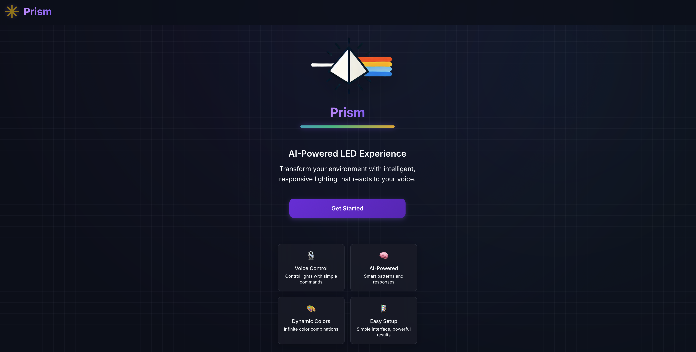
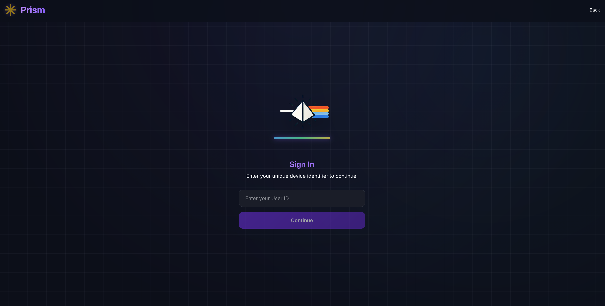
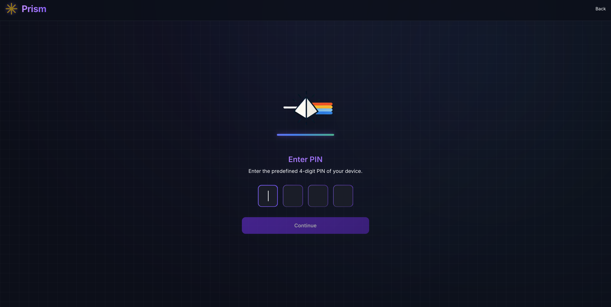
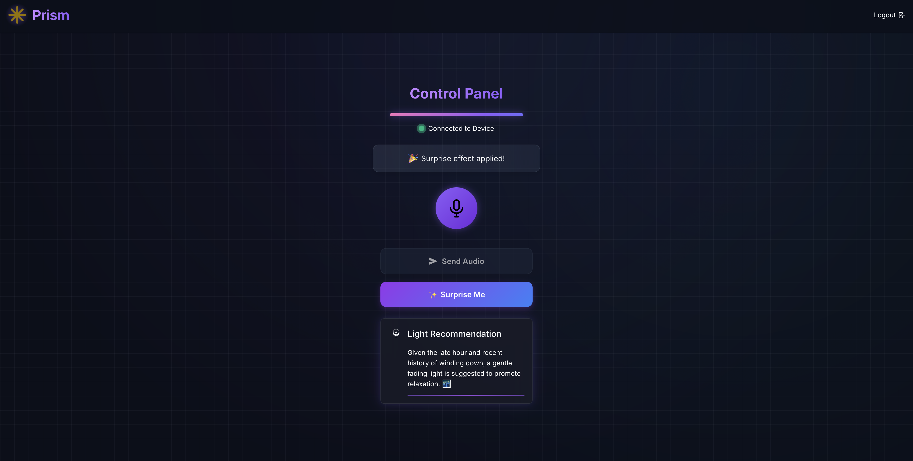
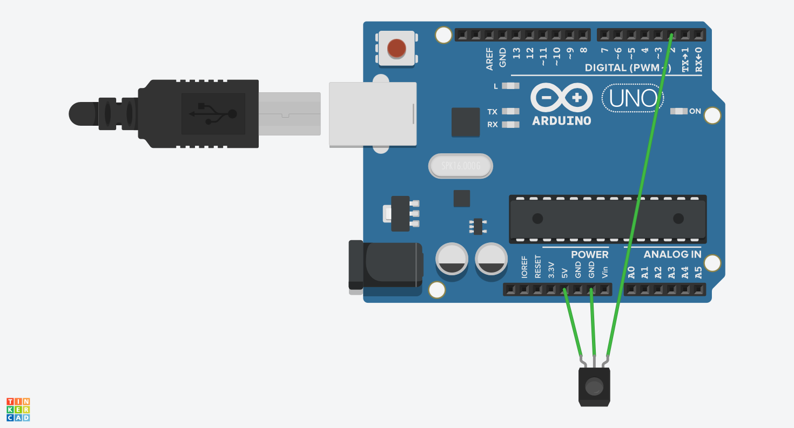
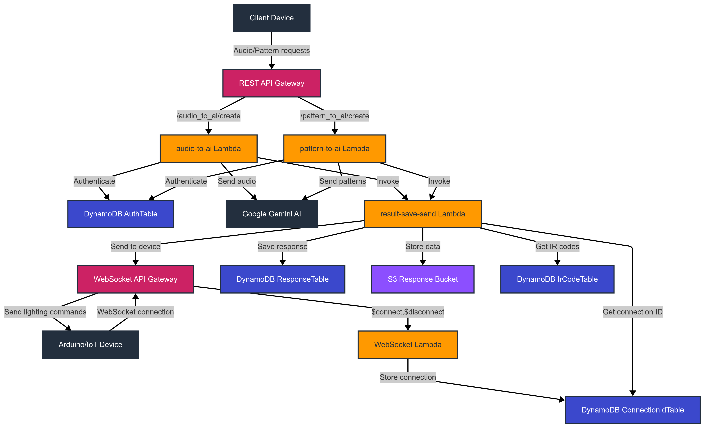

🎉 **Celebrating a New Era of Smart Lighting: Alpha Launch of Our AI-Powered LED Strip Controller!** 🌈

Have you ever invested in a costly smart LED strip, only to find yourself disappointed by basic features and limited automation capabilities? I experienced exactly that after buying a $50 \"smart\" LED strip. While manually configuring limited presets, I found myself questioning, \"Is this really all a $50 smart light can do?\"

Frustration sparked innovation. I imagined integrating advanced AI to create genuinely intelligent lighting—responsive to your mood, activities, and even anticipating your preferences. Rather than investing more into expensive products, I noticed an old LED strip in my room controlled only by a basic infrared (IR) remote. A question arose: Could I transform this ordinary strip into a cutting-edge, AI-powered lighting system?

## 🚀 Transforming Ordinary into Extraordinary

Our AI-driven lighting solution merges intelligent hardware, advanced AI backend, and intuitive frontend, revolutionizing your lighting experience with seamless, real-time responsiveness.

### 📌 How it Works: Voice Command

1. **Voice Input**: Describe your mood or situation (e.g., \"I'm studying,\" \"Feeling relaxed today\").
2. **Secure Transmission**: Voice data is securely sent via a frontend hosted on AWS S3 and CloudFront.
3. **AI Interpretation**: Gemini AI processes and understands your command, determining precise RGB color values and brightness.
4. **Instant Feedback**: Results are instantly communicated back to the frontend and simultaneously relayed via WebSockets to an Arduino-based ESP8266.
5. **Effortless Execution**: ESP8266 converts the instructions into IR signals, effortlessly adjusting your LED lighting.

### 🎲 The Magic of \"Surprise Me\"

1. **Historical Insights**: DynamoDB stores and retrieves your interaction history.
2. **AI Prediction**: Gemini AI analyzes usage patterns, intelligently predicting your mood or activity.
3. **Personalized Suggestions**: Tailored lighting settings are recommended based on your preferences.
4. **Instant Delivery**: AI-driven recommendations reach both frontend and hardware simultaneously.
5. **Dynamic Adjustments**: ESP8266 swiftly updates your lighting via precise IR signals.

Hardware setup couldn’t be simpler—just position the device near your LED strip’s IR receiver, instantly converting an ordinary setup into a smart lighting marvel.

_Project Prism landing page with voice input functionality_

_Device registration screen for UUID authentication_

_Security PIN setup interface for device pairing_

_Interactive control panel for managing LED settings_

## 🧩 Technical Architecture: Elegance Meets Efficiency

Our intelligent lighting solution is strategically organized into three interconnected components, optimized for rapid responsiveness, scalability, and security:

### Frontend

- Built using a static React application, globally hosted via AWS S3 and delivered through CloudFront, providing secure, low-latency user interactions.
- Facilitates voice recording and securely transmits user voice commands along with device authentication credentials (UUID and PIN).

### Backend

- Employs a fully serverless infrastructure leveraging AWS Lambda, API Gateway, DynamoDB, and S3.
- AWS Lambda functions (LLM Orchestration) handle authentication (UUID + PIN), audio processing requests, interaction with the Gemini AI, and real-time message delivery.
- DynamoDB stores device credentials, WebSocket connection identifiers, and preset device configurations, ensuring quick, efficient data retrieval.
- Amazon S3 securely stores processed audio results with server-side encryption, ensuring data privacy and integrity.
- API Gateway manages both REST API calls from the frontend and persistent WebSocket connections to hardware devices.

### Hardware

- Utilizes an Arduino-based ESP8266 module to connect to Wi-Fi, establishing a persistent WebSocket connection with the backend via AWS API Gateway.
- Receives real-time commands over WebSockets and converts them into precise IR signals to adjust LED strip settings.
- Ensures compatibility by mimicking standard IR remote control protocols, allowing easy integration with existing hardware setups.

_Hardware Diagram_

### Real-Time Communication & Security

- WebSockets ensure instantaneous, real-time communication crucial for seamless user experience.
- Minimal yet strategic security measures are in place, including basic authentication checks (UUID and PIN) and encrypted data storage. Future updates plan robust authentication enhancements with AWS Cognito or JWT-based security.
- Proactive error handling transparently informs users about connectivity issues or processing errors, enhancing overall reliability.

_Software Architecture Diagram_

## 🛠️ Tackling Technical Challenges Head-On

- **Revitalizing Old Hardware**: We turned a basic IR-controlled LED strip into a Wi-Fi-connected IoT marvel using ESP8266, significantly reducing costs without sacrificing features.
- **Precision RGB Management**: Facing initial RGB accuracy challenges, we implemented a clever solution—incremental RGB adjustments with real-time tracking stored on ESP8266 memory. Adjustments occur through precisely timed IR signals, ensuring accurate color representation.
- **Optimized AI Training Data**: Despite initially considering Aurora Serverless, we chose AWS S3 combined with AWS Data Pipeline for cost-effective, secure, and efficient AI training data management.

## 🌟 Unique Market Advantage

Unlike competitors like Lepro, which require new hardware investments and substantial monthly fees, our approach offers:

- **Cost Efficiency**: Hardware production at just $5 per unit and minimal AI operational costs.
- **Universal Compatibility & Sustainability**: Easily adaptable to virtually any IR-controlled LED strip, promoting reuse and environmental friendliness.
- **Scalable Infrastructure**: Serverless backend effortlessly manages varying usage, providing unmatched efficiency and performance.

## 🎖️ Join Our Alpha Journey!

Today marks the exciting alpha launch of our innovative AI-driven LED controller! Deep gratitude to everyone who supported and believed in this vision. Stay tuned as we continue refining, enhancing, and expanding our intelligent lighting solutions.

Together, we're redefining smart lighting—making it genuinely intelligent, widely accessible, and truly sustainable! 🌟
