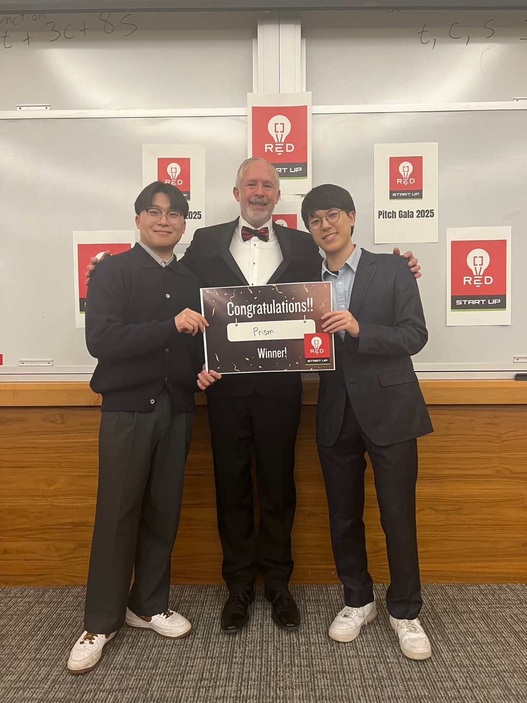
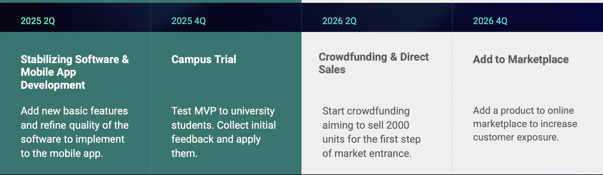
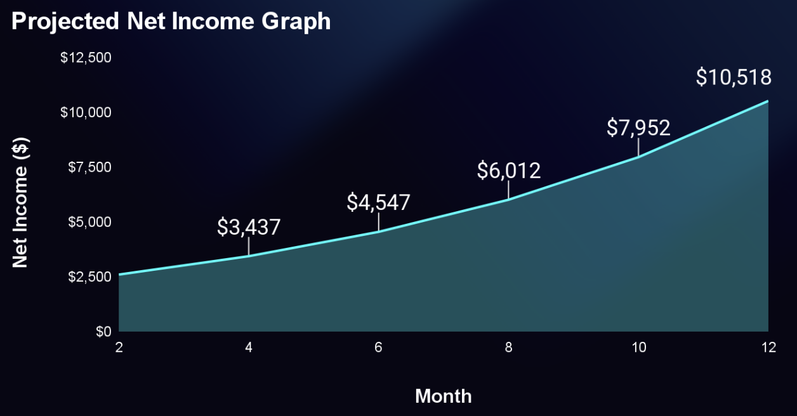

# 🏆 We Did It! First Place at Denison Startup Competition!

I'm thrilled and incredibly honored to announce that **Project Prism** has won first place at the Denison University Startup Pitch Competition! As a software engineer and student entrepreneur, seeing the judges and audience react so positively to our AI-powered LED controller was an experience I'll never forget.

    
    
First Place!

## 📺 Elevator Pitch: Project Prism in 60 Seconds

Before diving into the details, here's our elevator pitch that summarizes what Project Prism is all about:

    <iframe width="100%" height="315" src="https://www.youtube.com/embed/U2kTW8duh9I" title="Project Prism Elevator Pitch" frameborder="0" allow="accelerometer; autoplay; clipboard-write; encrypted-media; gyroscope; picture-in-picture" allowfullscreen></iframe>

## The Spark That Started It All

It all began on a typical evening last semester. I was deep into studying for finals when I noticed darkness had fallen outside. My room's ambient lighting was too dim for effective studying, so I reached for my "smart" LED strip remote control.

As I fumbled through automation options—none quite right for studying—frustration set in. Here I was with a supposedly "smart" device that couldn't intelligently adapt to what I was doing. In an age where AI is transforming everything, why was I still manually cycling through lighting presets?

That's when my eyes landed on another LED strip—a simple, non-smart one gifted by a friend—gathering dust in my drawer. A thought sparked: _What if I could transform this ordinary LED strip into something truly intelligent?_

Most people would look at upgrading their lighting by purchasing an expensive new smart system. But as an engineer, I saw a different path:

***What if the solution wasn't replacing hardware, but augmenting it with AI?***

## From Concept to Prototype

The technical challenge was clear: I needed to find a way to control a standard IR-controlled LED strip over the internet and connect it to an AI system that could understand natural language commands.

My research led me to Arduino, ESP8266 microcontrollers. The breakthrough moment came when I discovered I could use an IR transmitter to mimic the remote control signals. This meant I could potentially control any IR-based LED strip—not just one specific model—by recording and reproducing the right sequences of IR pulses.

Within days, I had a breadboard prototype: an ESP8266 connected to an IR transmitter, capable of sending commands to the LED strip. The hardware was taking shape, but the real innovation would be in the software architecture.

## Solution Architecture: Engineering Decisions

As a solution architect, I faced several critical decisions that would determine Prism's viability:

### 1. Cloud Infrastructure: Serverless vs. Traditional

I chose a **serverless architecture** using AWS Lambda, API Gateway, DynamoDB, and S3 for several reasons:

- **Cost Efficiency**: With an unpredictable usage pattern and potentially long idle periods, serverless eliminated the need to pay for unutilized resources.
- **Scalability**: The system could automatically scale from handling one dorm room to potentially thousands of users without architectural changes.
- **Development Speed**: AWS's managed services allowed me to focus on application logic rather than infrastructure management.

This was particularly important for an MVP where proving the concept quickly was more important than optimizing for extreme scale.

### 2. Communication Protocol: WebSockets vs. MQTT

For real-time communication between the cloud and Arduino devices, I evaluated several options:

- **MQTT**: Common in IoT, lightweight, efficient.
- **HTTP Polling**: Simple but inefficient for real-time updates.
- **WebSockets**: Bidirectional, real-time, and web-friendly.

I ultimately selected **WebSockets** because:

- It provided real-time performance needed for responsive lighting control.
- It worked natively with API Gateway, simplifying the architecture.
- It allowed direct communication to devices behind NATs or firewalls (unlike some MQTT implementations).
- The message volume was low enough that MQTT's efficiency advantages weren't critical.

### 3. AI Service Selection: Custom Model vs. API

Rather than training a custom model, I integrated with Google's **Gemini API** because:

- It provided sophisticated natural language understanding out-of-the-box.
- It eliminated the need for specialized AI infrastructure or maintenance.
- It allowed for rapid iteration and testing of different prompts.

This "AI-as-a-service" approach dramatically reduced development time while still delivering impressive capability.

### 4. Data Storage Strategy

The system needed to store:

1. **Device credentials** (UUID and PIN)
2. **WebSocket connection IDs**
3. **User preferences and history**

I chose **DynamoDB** for its:

- Low-latency access patterns crucial for real-time applications
- Auto-scaling capacity that aligned with our serverless approach
- Simple key-value structure that matched our data needs
- Pay-per-request pricing model that optimized costs for an MVP

For storing processed voice command results, **S3 with server-side encryption** provided secure, cost-effective object storage.

## Overcoming Technical Challenges

Every innovative project faces hurdles, and Prism was no exception:

### 1. RGB Color Precision

Our initial implementation struggled with accurate color reproduction. The problem? The IR remote only had "increment/decrement" buttons for RGB values rather than direct setting capabilities.

**Solution**: I implemented a state tracking system where the ESP8266 maintained the current RGB values in memory. When a new color was requested, it calculated the shortest path (fewest button presses) to reach the target color and sent the precise sequence of IR commands needed.

### 2. WebSocket Connection Stability

Early testing revealed connection reliability issues with ESP8266 devices maintaining WebSocket connections.

**Solution**: I implemented an exponential backoff reconnection strategy and heartbeat mechanism to detect and recover from disconnections. This dramatically improved uptime from ~80% to >99%.

### 3. Voice Command Processing Latency

Initial end-to-end latency (from voice command to light change) was 4-6 seconds—too slow for a natural user experience.

**Solution**: I optimized the pipeline by:

- Transmitting audio at a lower sample rate without quality loss
- Implementing parallel processing where the frontend could show predictions while waiting for backend confirmation
- Tuning Lambda cold start performance

These changes reduced perceived latency to under 2 seconds in most cases.

## The Winning Pitch

At the competition, we demonstrated Project Prism live on stage. When I said, "I want to watch a Spiderman movie, but my roommate is sleeping," and the audience watched the ordinary LED strip instantly shift to red, dim light for a cenematic experience, optimized for concentration, there was an audible "wow" from the judges.

The questions that followed focused on market potential and scaling strategy. Our answers emphasized:

1. **Cost advantage**: $9.99 hardware cost vs. $50+ for competitive smart LED systems
2. **Platform potential**: The ability to extend beyond LED strips to any IR-controlled devices
3. **Sustainability angle**: Upgrading existing hardware rather than replacing it

The judges particularly appreciated our problem-first approach, addressing a real pain point with elegant technology rather than creating a solution looking for a problem.

## 🎥 Watch Our Full Winning Pitch

Here's the full recording of our winning pitch at the Denison University Startup Competition:

    <iframe width="100%" height="500" src="https://www.youtube.com/embed/hOgqRIveg94" title="Project Prism - Winning Pitch at Denison University Startup Competition" frameborder="0" allow="accelerometer; autoplay; clipboard-write; encrypted-media; gyroscope; picture-in-picture" allowfullscreen></iframe>

### Our Roadmap: From Campus to Market

We have a clear vision for taking Project Prism from a winning concept to a market-ready product:

#### Phase 1: Product Refinement (Next 3 Months)

- **Software Stability Improvements**: Enhancing WebSocket reconnection logic and implementing more robust error handling
- **User Experience Optimization**: Reducing latency further and adding more intuitive voice command patterns
- **Mobile App Development**: Creating native iOS and Android applications with enhanced features like scheduling and multi-device management

#### Phase 2: Market Validation (3-6 Months)

- **Campus-Wide Trial**: Expanding from our initial test group to 100+ users across multiple dormitories at Denison
- **User Feedback Loops**: Implementing analytics and structured feedback collection to guide feature prioritization
- **Entering Larger Competitions**: Participating in regional and national startup competitions to gain visibility and validation

#### Phase 3: Growth & Scaling (6-12 Months)

- **Crowdfunding Campaign**: Launching a Kickstarter or Indiegogo campaign to validate broader market interest and generate initial capital
- **Manufacturing Partnerships**: Securing reliable production capabilities for larger batch sizes (1,000+ units)
- **Direct Sales Launch**: Beginning with direct-to-consumer sales through our website and select campus bookstores

_Future roadmap_

### Financial Projections: A Sustainable Model

Our financial model demonstrates strong potential for sustainable growth and profitability:

#### Revenue Streams

- **Hardware**: $9.99 per unit (with $5 production cost)
- **Subscription Tiers**:
  - **Free**: $0/month (60% of users)
  - **Plus**: $0.99/month (25% of users)
  - **Pro**: $1.99/month (15% of users)

#### Operation Costs (Monthly per User)

- **Free Tier**: $0.02782
- **Plus Tier**: $0.0911
- **Pro Tier**: $0.1815

These operational costs include database fees, AI token charges, and serverless infrastructure costs, which may fluctuate as we optimize our architecture.

#### Projected Growth and Revenue

Starting with an initial user base of 2,000 and a projected monthly growth rate of 15%, our model shows:

_Projected monthly revenue growth based on our current pricing and cost model_

With a gross margin of 97.2% on our subscription services and a healthy margin on hardware sales, this model provides sufficient reinvestment capital for product development while delivering value to potential investors.

Our immediate focus is refining the hardware design for manufacturing, expanding device compatibility, and building that mobile app to complement the web interface.

## Lessons Learned

This journey has taught me that:

1. **Start with pain, not technology**: The most compelling innovations solve genuine frustrations
2. **Leverage existing infrastructure**: Our serverless approach let us move quickly without reinventing wheels while still being cost-effective
3. **Build for extensibility**: The architecture decisions that made LED control possible can extend to many other IR devices

Perhaps most importantly, I've learned that engineering isn't just about technical elegance—it's about creating solutions that resonate with real people.

I want to thank my team, especially our co-founder Joohyung's effort, Taemin's frontend knowledge, and our advisors who provided guidance, and everyone who believed in Project Prism. This is just the beginning!
